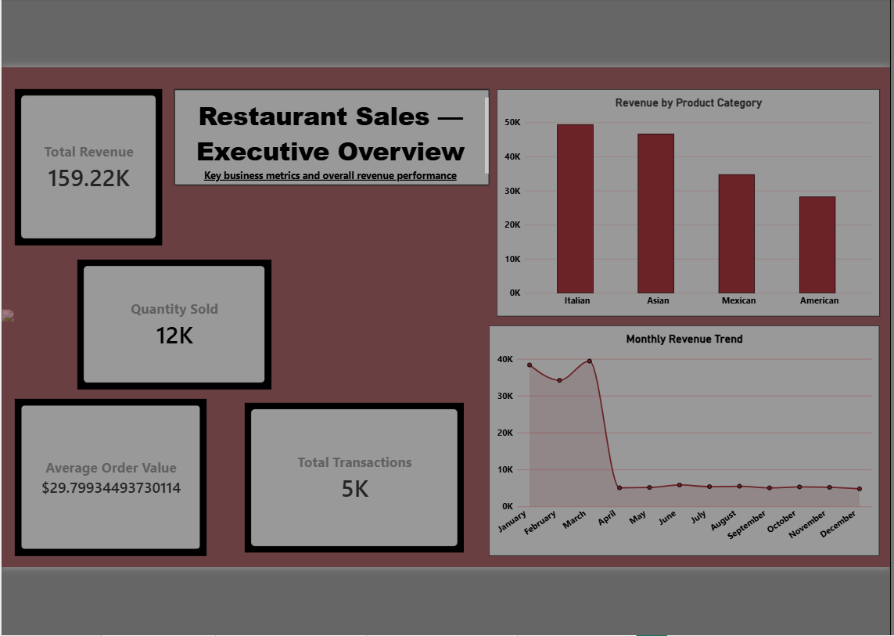
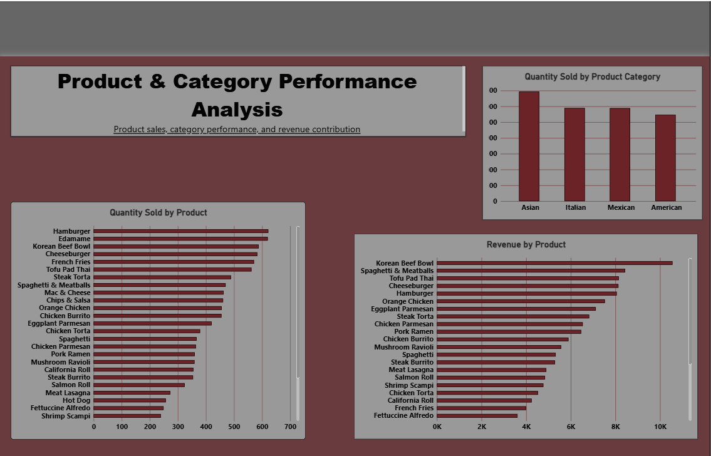
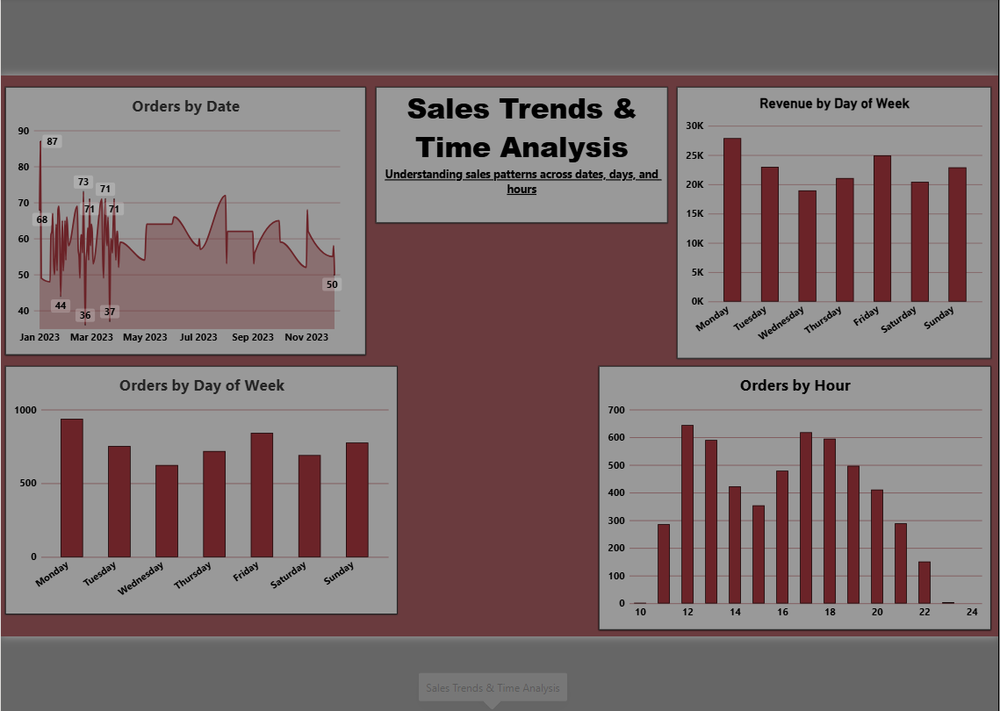
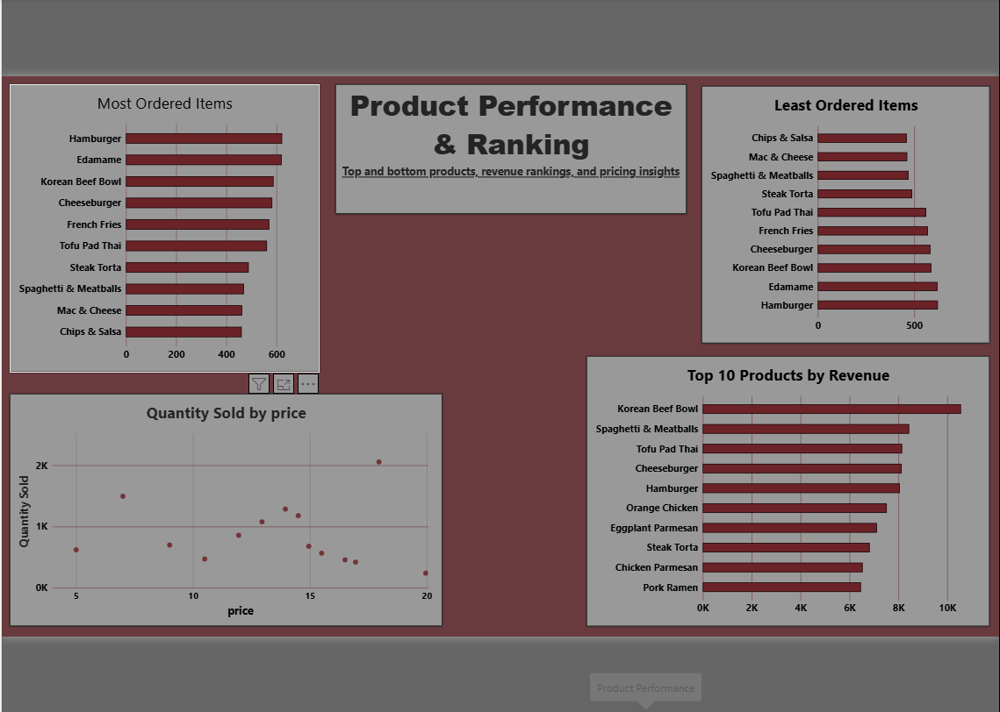

# Restaurant Sales Analysis Dashboard | Power BI

## 📊 Project Overview

**Restaurant Sales Analysis Dashboard** is an interactive Microsoft Power BI project designed to analyze restaurant sales performance, product performance, revenue trends, transaction patterns, and ordering behavior.

The project transforms restaurant order data into a multi-page business intelligence dashboard that makes key sales metrics and product insights easier to understand.

---

## 🎯 Project Objectives

- Monitor overall restaurant sales performance
- Track revenue, transactions, quantity sold, and average order value
- Analyze revenue contribution by product category
- Identify high-performing and low-performing products
- Analyze sales patterns across dates, days of the week, and hours
- Compare product price with quantity sold
- Present business insights through interactive Power BI visualizations

---

## 🗂️ Dashboard Structure

The report contains **4 analysis pages**.

### 1. Executive Overview

Provides a high-level view of restaurant performance.

**Key KPIs:**
- Total Revenue
- Total Transactions
- Quantity Sold
- Average Order Value

**Visuals:**
- Monthly Revenue Trend
- Revenue by Product Category

This page is designed to give a quick overview of the most important business metrics.

---

### 2. Product & Category Analysis

Focuses on product and category-level performance.

**Visuals:**
- Quantity Sold by Product Category
- Revenue by Product
- Quantity Sold by Product

This page helps compare products and categories using both revenue and quantity-based measures.

---

### 3. Sales Trends & Time Analysis

Analyzes how restaurant orders change over time.

**Visuals:**
- Orders by Date
- Revenue by Day of Week
- Orders by Day of Week
- Orders by Hour

This page supports time-based analysis and helps identify patterns in ordering activity.

---

### 4. Product Performance

Provides detailed product ranking and pricing analysis.

**Visuals:**
- Most Ordered Items — Top 10
- Least Ordered Items — Bottom 10
- Top 10 Products by Revenue
- Product Price vs Quantity Sold

Top and bottom product analysis was created using Power BI filtering/ranking features.

---

## 🧹 Data Preparation

The data was prepared using **Power Query** before dashboard development.

Data preparation included:

- Checking missing and blank values
- Checking duplicate records
- Validating data types
- Converting `order_date` to Date
- Converting `order_time` to Time
- Reviewing product and order identifiers
- Handling order records with missing `item_id`
- Validating product ID matching between menu and order data
- Preparing fields required for time-based analysis

The order data originally contained records with missing `item_id`; these records were filtered out so that order lines could be correctly associated with menu items.

---

## 🧩 Data Model

The project uses two main tables:

### `menu_items`

Contains product/menu information:

- `menu_item_id`
- `item_name`
- `category`
- `price`

### `order_details`

Contains order-level detail:

- `order_details_id`
- `order_id`
- `order_date`
- `order_time`
- `item_id`

The model uses a **one-to-many relationship**:

```text
menu_items
    |
    | 1
    |
    | *
order_details
```

Relationship:

```text
menu_items[menu_item_id]
        ↓
order_details[item_id]
```

The menu table provides product attributes such as item name, category, and price, while the order table contains transaction-level activity.

---

## 📐 DAX Measures

### Total Revenue

```DAX
Total Revenue =
SUMX(
    'order_details',
    RELATED('menu_items'[price])
)
```

Calculates total revenue by retrieving the corresponding menu item price for each order-detail row.

---

### Total Transactions

```DAX
Total Transactions =
DISTINCTCOUNT('order_details'[order_id])
```

Counts unique orders rather than individual order-detail rows.

---

### Quantity Sold

```DAX
Quantity Sold =
COUNTROWS('order_details')
```

Counts the number of order-detail records used as the quantity sold measure.

---

### Average Order Value

```DAX
Average Order Value =
DIVIDE(
    [Total Revenue],
    [Total Transactions],
    0
)
```

Calculates the average revenue generated per transaction.

---

## 📅 Calculated Columns

The report also uses calculated columns for time analysis.

### Day Name

```DAX
Day Name =
FORMAT('order_details'[order_date], "dddd")
```

### Day Number

```DAX
Day Number =
WEEKDAY('order_details'[order_date], 2)
```

The day number is used to keep weekday names in the correct Monday-to-Sunday order.

### Order Hour

```DAX
Order Hour =
HOUR('order_details'[order_time])
```

Extracts the hour from the order time for hourly order analysis.

### Month Name

```DAX
Month Name =
FORMAT('order_details'[order_date], "MMMM")
```

### Month Number

```DAX
Month Number =
MONTH('order_details'[order_date])
```

Month names are sorted by month number so that months appear chronologically.

---

## 📊 Visualizations Used

The project demonstrates several Power BI visualization types:

- KPI/Card visuals
- Line charts
- Clustered column charts
- Clustered bar charts
- Scatter chart
- Top N / Bottom N filtering
- Interactive cross-filtering
- Time-based analysis

---

## 🔎 Business Analysis Areas

The dashboard covers several important business intelligence questions:

### Revenue Analysis
- How is revenue changing over time?
- Which product categories contribute the most revenue?
- Which products generate the most revenue?

### Product Analysis
- Which items are ordered most frequently?
- Which items are ordered least frequently?
- Which products rank highest by revenue?

### Customer Ordering Patterns
- How many transactions occur on different days?
- Which hours have more ordering activity?
- How does order activity change over time?

### Pricing Analysis
- How does product price relate to quantity sold?
- Are higher-priced products necessarily ordered less frequently?

---

## 🛠️ Tools & Technologies

- **Microsoft Power BI**
- **Power Query**
- **DAX**
- **Data Cleaning**
- **Data Transformation**
- **Data Modeling**
- **Data Visualization**
- **Business Intelligence**
- **Dashboard Development**

---

## 💡 Key Skills Demonstrated

This project demonstrates practical skills in:

- Data cleaning
- Data validation
- Power Query transformations
- Relational data modeling
- DAX measure creation
- Calculated columns
- Time-based analysis
- KPI development
- Product performance analysis
- Top N / Bottom N analysis
- Interactive dashboard design
- Business-focused data visualization

---

## 📁 Suggested Repository Structure

```text
Restaurant-Sales-PowerBI/
│
├── Restaurant_Sales_Dashboard.pbix
├── README.md
│
└── screenshots/
    ├── executive-overview.png
    ├── product-category-analysis.png
    ├── sales-trends-time-analysis.png
    └── product-performance.png
```

---

## 🖼️ Dashboard Screenshots

Add screenshots of each Power BI page to the `screenshots` folder.

Recommended names:

1. `executive-overview.png`
2. `product-category-analysis.png`
3. `sales-trends-time-analysis.png`
4. `product-performance.png`

Then add them to this README using:

## 📊 Dashboard Preview

### 1. Executive Overview



### 2. Product & Category Analysis



### 3. Sales Trends & Time Analysis



### 4. Product Performance



## 🚀 How to Use

1. Download the `.pbix` file from this repository.
2. Open it using Microsoft Power BI Desktop.
3. Review the report pages and interactive visuals.
4. Use filters and visual interactions to explore the data.
5. Review the DAX measures and data model to understand the analysis.

---

## 📌 Portfolio Value

This project demonstrates how raw restaurant order data can be transformed into an interactive business intelligence solution using Power BI.

It combines **data preparation, data modeling, DAX calculations, time analysis, product analysis, and dashboard design** into one end-to-end analytics project.

---

## 👩‍💻 Project Author

**Sunnaina Tanveer**

### Skills

`Power BI` `DAX` `Power Query` `Data Analysis` `Data Visualization` `Data Cleaning` `Data Modeling` `Business Intelligence`

---

## ⭐ Project Highlights

- 4-page Power BI report
- Executive KPI dashboard
- Revenue and transaction analysis
- Product and category analysis
- Time-based sales analysis
- Top 10 and Bottom 10 product analysis
- Product pricing vs quantity analysis
- DAX-based business metrics
- Power Query data preparation
- Relational data model

